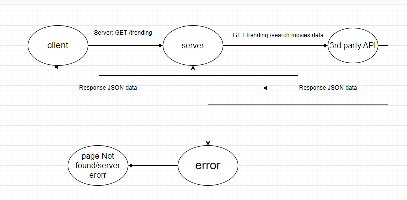

# Movies-Library
 v1.0.0

**Author Name:** [Mosua'b rami waleed khalefah]

## Overview
The Movies Library is a movie app that allows users to check the latest movies based on categories. This project involves building the server and the database for the app.

## Getting Started
To build and run this app on your local machine, follow these steps:

1. Clone the repository:by git clone command

2. Install the required packages:(express,cors, axios dotenv) npm install

3. Start the server: npm start
4. add .env file and add SECRET_API=2fe3227676b48c615554c0b555b8389a

4. Open your web browser and visit: `http://localhost:3000`

## Project Features
The Movies Library app includes the following features:

1. Home Page Endpoint:
- Route: `/`
- Method: GET
- Response: JSON data of the latest movie details.

2. Favorite Page Endpoint:
- Route: `/favorite`
- Method: GET
- Response: Welcome message for the Favorite 

3. trending Page Endpoint:
- Route: `/trending`
- Method: GET
- Response: return all movies as object.

4. search Endpoint:
- Route: `/search`
- Method: GET 
- Response: JSON data of the what Im searching on.
-you should add ?querymovName=(name of movie you want)

